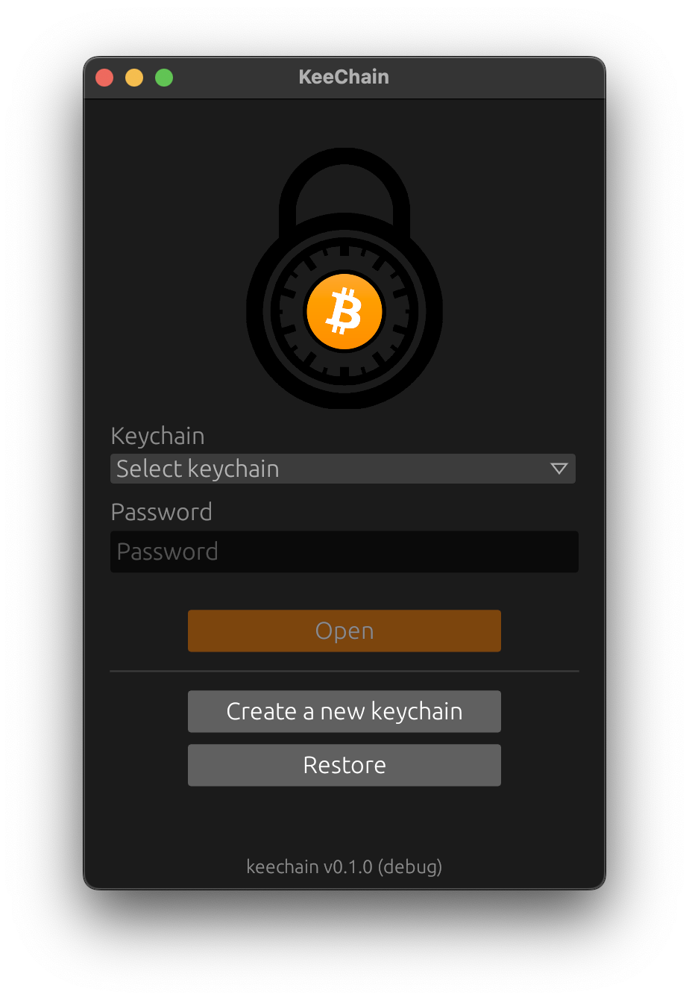
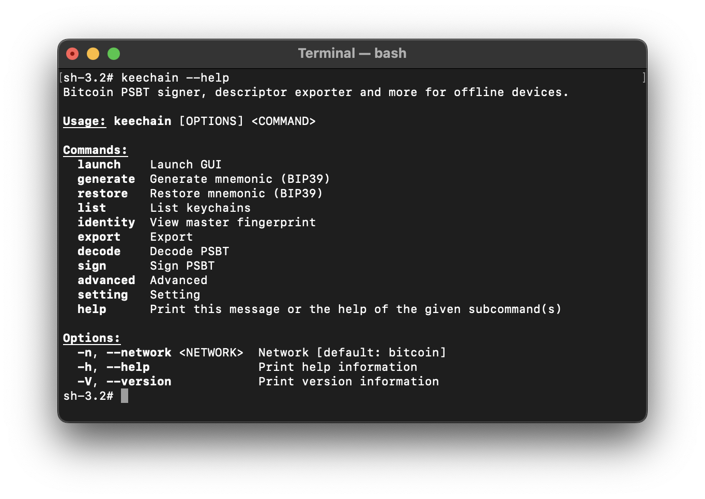

# KeeChain

## Description

KeeChain is a Bitcoin application to transform your **offline** computer in an AirGap Signing Device (aka Hardware Wallet).

<table>
    <tr>
        <td>  </td>
        <td>  </td>
    </tr>
</table>

## Getting started

* [Build from source](doc/build.md) 
* [Usage](doc/usage.md) 

## Features

* Generate mnemonic (BIP39) using many sources of entropy:
    - True random number generator (TRNG)
    - Cryptographically secure pseudo-random number generator (CSPRNG)
    - Dynamic events: timestamp, boot time, total and free memory, total and free SWAP, OS processes and load average
    - Static events: hostname, OS and kernel version, global CPU info and device users
    - Optional: dice roll 🎲
* Restore mnemonic (BIP39)
* Apply and, optionally, save passphrases (BIP39)
* Keychain encryption with AES-256
* Export:
    - Descriptors
    - Bitcoin Core descriptors (same as above but already formatted to be inserted into the console using the `importdescriptors` command)
    - Electrum JSON file (BIP44, BIP49 and BIP84)
* Sign and decode PSBT file
* Deterministic Entropy (BIP85)
* Danger:
    - View secrets: entropy, mnemonic, passphrase, HEX seed, BIP32 root key and fingerprint.
    - Wipe: permanently delete keychain
* Optional:
    - [Nostr](https://github.com/nostr-protocol/nostr) sign event delegation (NIP26)

## State

⚠️ **This project is in an ALPHA state, use at YOUR OWN RISK and, possibly, with only testnet coins until release.** ⚠️

## License

This project is distributed under the MIT software license - see the [LICENSE](LICENSE) file for details
